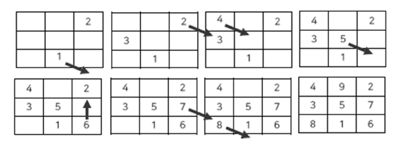

# 홀수 마방진
## 문제
마방진은 n^2개의 수를 가로, 세로 대각선 방향으로 수를 더하면 모두 같은 결과가 나오도록 구현한 n by n 행렬이다.
n이 홀수일 때 마방진을 구하기 위해 아래 알고리즘을 참고하여 작성하시오.

[n이 홀수일 때]
  

- 그림은 왼쪽 위부터 차례대로 읽으면 항목이 됩니다.
   > 1 -> 2 -> 3 -> 4 ->  
   > 5 -> 6 -> 7 -> 8

1. 첫번째 시작 지점은 맨 아랫 줄에 중간으로 잡으면 된다. - 그림에서 1번 항목 참고
2. 다음 수를 현재 위치에서 한 줄 아래, 한 칸 우측에 둔다. - 그림에서 2번 항목 참고
3. 만약, 현재 행에서 더 이상 다음 행으로 갈 수 없다면, 첫번째 행으로 되돌아온다.
만약, 현재 열에서 더 이상 다음 열로 갈 수 없다면, 첫번째 열로 되돌아온다. - 그림에서 2번, 6번, 7번 항목 참고
4. 만약, 두고자 하는 위치에 이미 값이 존재하면, 현재 위치로부터 한 줄 위에 같은 칸에 둔다. - 그림에서 3번, 5번 항목 참고

* TIP 1: 2차원 배열의 첫번째 행과 마지막 행은 서로 연결되어 있다고 생각하면 되고,
첫번째 열과 마지막 열은 서로 연결되어 있다고 생각하면 이해하기 쉽다.

아래 입력 예와 출력 예와 같이 되도록 프로그램을 작성하시오.

## 입력 예
n by n? (n is odd number!) >> 5

## 출력 예
(n = 5)  
11 18 25 2 9   
10 12 19 21 3  
4 6 13 20 22  
23 5 7 14 16  
17 24 1 8 15  